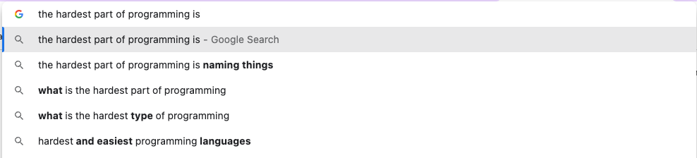

# Molly

Molly is a tool for generating code from natural-language text files.

You write this:

```markdown
- A PBJ has two slices of bread
- A PBJ has peanut butter
- A PBJ has jelly
- A jar has some kind of spread
- Peanut butter is a kind of spread
- Jelly is a kind of spread
- A loaf of bread has many bread slices
```

Then, Molly makes this:

```java
// PBJ.java
public class PBJ {
    List<Bread.Slice> slices;

    PeanutButter peanutButter;

    Jelly jelly;

    public List<Bread.Slice> getSlices() {
        return slices;
    }

    public PeanutButter getPeanutButter() {
        return peanutButter;
    }

    public Jelly getJelly() {
        return jelly;
    }
}
```

```java
// Bread.java
public class Bread {

    public static class Slice {
    }

    public static class Loaf {
        List<Slice> slices;

        public List<Slice> getSlices() {
            return slices;
        }
    }
}
```

```java
// PeanutButter.java
public class PeanutButter extends Spread {
}
```

```java
// Jelly.java
public class Jelly extends Spread {
}
```

```java
// Jar.java
public class Jar<T extends Spread> {
    T spread;

    public T getSpread() {
        return spread;
    }
}
```

## Goals

We hope this project helps you:

* Communicate better, by aligning your team to a shared language
* Write better software, by creating a more direct correspondence between what your code _is_ and what it's _for_.

Eventually, given something like this:

```gherkin
Background:
  * There is a loaf of bread called the "bread"
  * There is a jar called the "jelly jar", which has jelly
  * There is a jar called the "peanut butter jar", which has peanut butter
  * I can make a PBJ

Scenario:
  Given my ingredients include the bread, the jelly jar, and the peanut butter jar
  When I make a PBJ using my ingredients
  Then I have a PBJ
```

...we want Molly to be able to _write tests for you_, by combining the power of a BDD test runner like Cucumber with a structured language AST and parsing engine managed by Molly.

## Motivation



We started writing Molly because we believe there's an element of truth in the preceding image: there are very few tools that help you name things well. Linters come close, but they limit their scope to syntax, layout, and "code style." Molly bridges the gap into the _semantics_ of the objects that _you_ define.

Clarifying your language does more than resolve arguments. It reveals the structure of the virtual "world" that your software defines, and aligns our mental models to that structure. We believe this can result in drastic improvements to our ability to produce and maintain software. Furthermore, we believe it makes for more _usable_ software as well, if the software manifests this shared model to the end user as well.   
